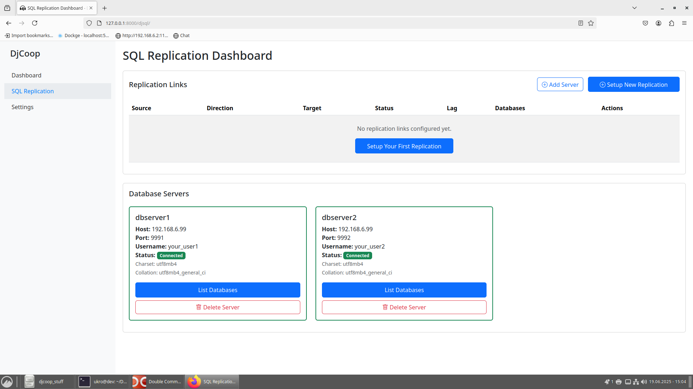
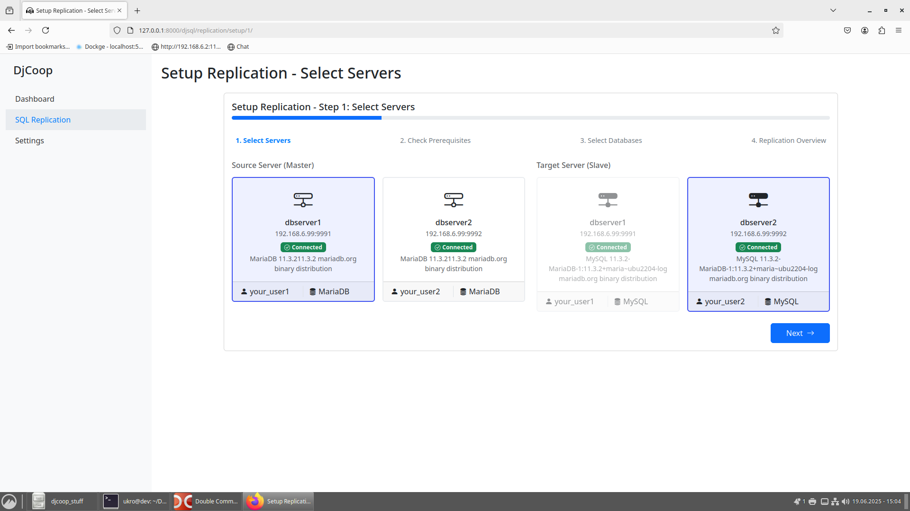
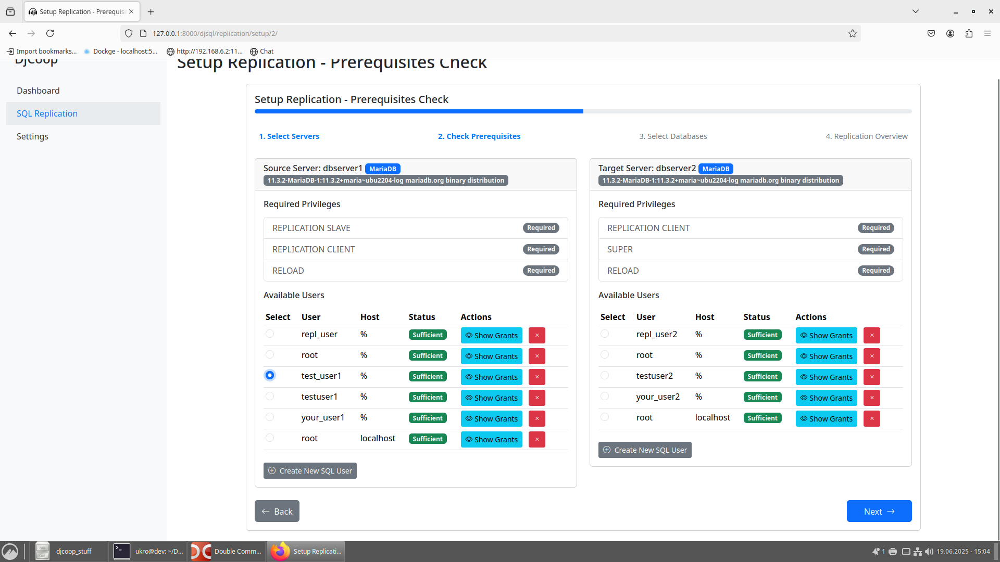
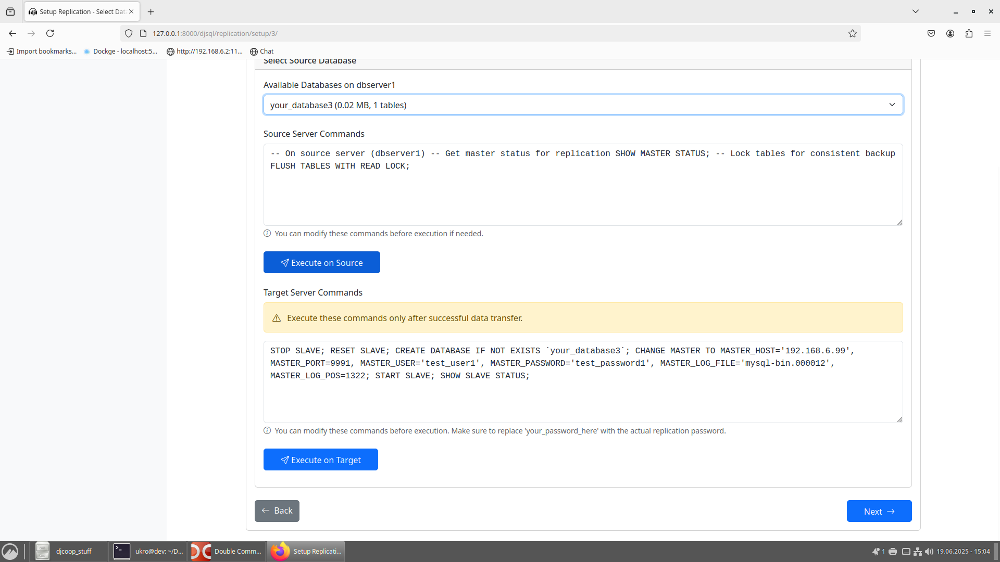
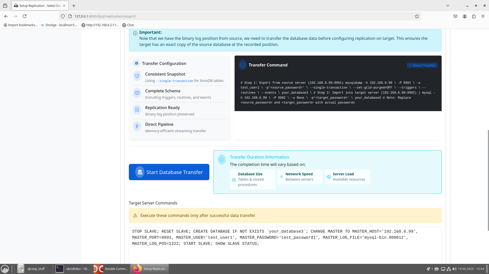
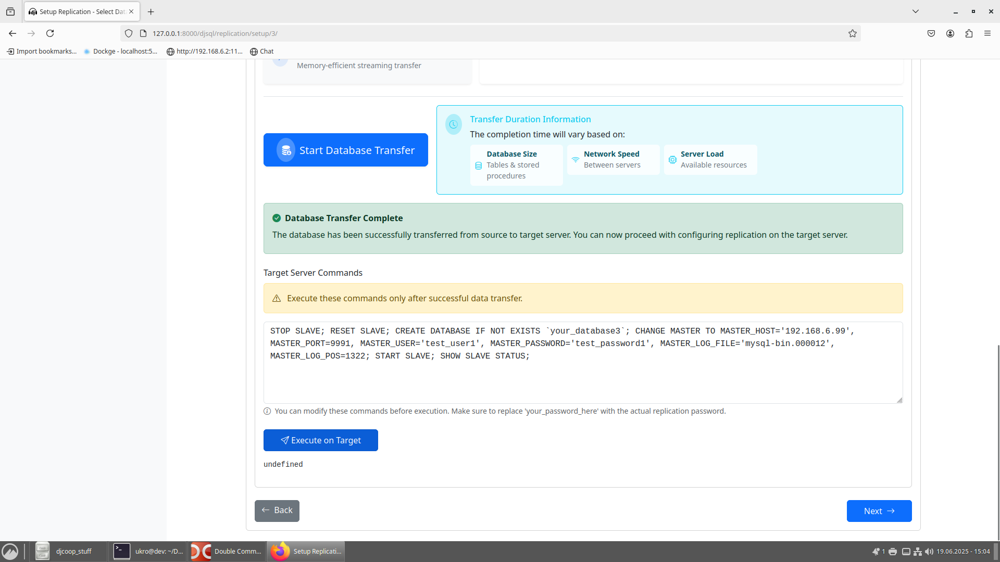
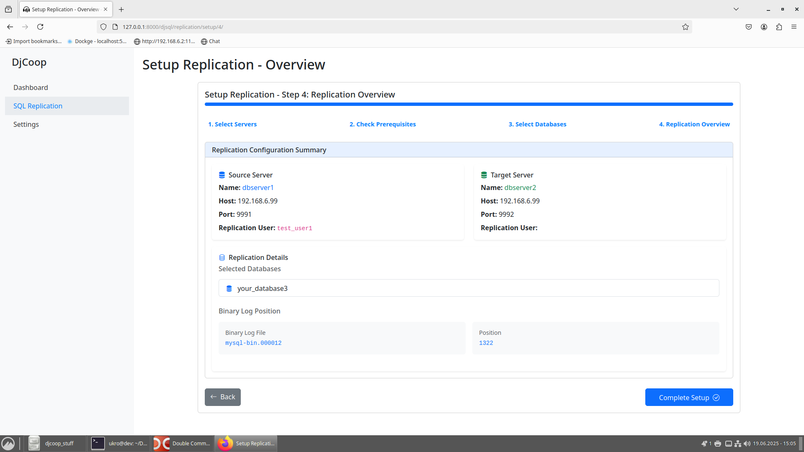
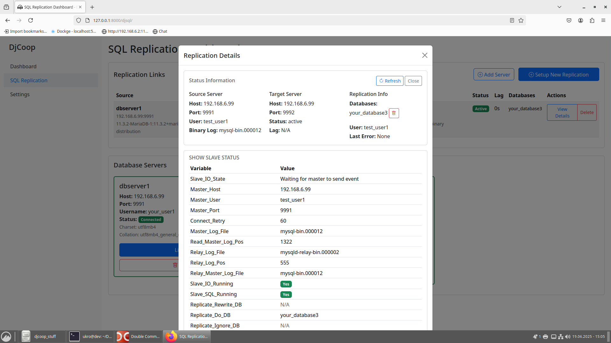

# Djcoop project that consist of several apps that help me in IT work


## MariaDB SQL Replication Setup

The first part of this project focuses on setting up MariaDB SQL replication between servers.


#### Django Application Setup

Run the Django application. Navigate to the root `djcoop` directory and execute the following commands:

1.  **Run Django Development Server:**
    ```bash
    python manage.py runserver
    ```
2.  **Apply Database Migrations:**
    ```bash
    python manage.py makemigrations
    python manage.py migrate
    ```
    These commands will prepare your Django application's database schema.


**This first part of the project was built with the assistance of [`refact.ai "KUDOS Refact Team"`](https://refact.ai/).**


### Screenshots











### Example Testing with Demo Servers (Docker Compose)

The `docker-examples` folder contains configurations for two MariaDB servers (`dbserver1` and `dbserver2`) designed to demonstrate replication.

#### Server 1: `dbserver1`

Navigate to `docker-examples/dbserver1/` and run `docker compose up -d`.

**`docker-examples/dbserver1/docker-compose-dbserver1.yaml`:**
```yaml
version: "3.8"
services:
  mariadb1:
    image: mariadb:latest
    container_name: mariadb1
    restart: unless-stopped
    environment:
      MYSQL_ROOT_PASSWORD: your_root_password1
      MYSQL_DATABASE: your_database1
      MYSQL_USER: your_user1
      MYSQL_PASSWORD: your_password1
    ports:
      - 9991:3306
    volumes:
      - /mnt/docksync_ns/mysql1/custom/my-custom.cnf:/etc/mysql/conf.d/my-custom.cnf
      - /mnt/docksync_ns/mysql1/data:/var/lib/mysql
      - /mnt/docksync_ns/mysql1/init:/docker-entrypoint-initdb.d
    command: --bind-address=0.0.0.0
networks: {}
```
*   **`image: mariadb:latest`**: Specifies the MariaDB Docker image to use.
*   **`container_name: mariadb1`**: Assigns a recognizable name to the container.
*   **`ports: - 9991:3306`**: Maps port 9991 on your host to port 3306 inside the container, allowing access to MariaDB.
*   **`volumes`**: Mounts local directories into the container for custom configurations, persistent data, and initialization scripts.
    *   The `/docker-entrypoint-initdb.d` volume is used to place initialization scripts. The `remote_access.sql` file, located at `docker-examples/dbserver1/mysql1/init/remote_access.sql`, is used to grant remote access privileges to the database user:
        ```sql
        GRANT ALL PRIVILEGES ON *.* TO 'your_user1'@'%' IDENTIFIED BY 'your_password1' WITH GRANT OPTION;
        FLUSH PRIVILEGES;
        ```

#### Server 2: `dbserver2`

Navigate to `docker-examples/dbserver2/` and run `docker compose up -d`.

**`docker-examples/dbserver2/docker-compose-dbserver2.yaml`:**
```yaml
version: "3.8"
services:
  mariadb2:
    image: mariadb:latest
    container_name: mariadb2
    restart: unless-stopped
    environment:
      MYSQL_ROOT_PASSWORD: your_root_password2
      MYSQL_DATABASE: your_database2
      MYSQL_USER: your_user2
      MYSQL_PASSWORD: your_password2
    ports:
      - 9992:3306
    volumes:
      - /mnt/docksync_ns/mysql2/custom/my-custom.cnf:/etc/mysql/conf.d/my-custom.cnf
      - /mnt/docksync_ns/mysql2/data:/var/lib/mysql
      - /mnt/docksync_ns/mysql2/init:/docker-entrypoint-initdb.d
    command: --bind-address=0.0.0.0
networks: {}
```
*   Similar to `dbserver1`, but uses `mariadb2` as container name and maps to host port `9992`.
*   The `init` volume also contains a `remote_access.sql` file for granting remote access.

#### Custom MariaDB Configuration (`my-custom.cnf`)

This file is mounted into the MariaDB containers to configure replication and other settings.

**`docker-examples/dbserver1/mysql1/custom/my-custom.cnf`:**
```ini
[mysqld]
log_bin = mysql-bin
server-id = 1
binlog_format = ROW
character-set-server = utf8mb4
collation-server = utf8mb4_general_ci
```
*   **`log_bin = mysql-bin`**: Enables binary logging, which is essential for replication.
*   **`server-id = 1` (for `dbserver1`)**: Each server in a replication topology must have a unique `server-id`. `dbserver1` uses `1`, and `dbserver2` (not shown here, but configured similarly in its `my-custom.cnf`) uses `10` to ensure distinct identification within the replication setup.
*   **`binlog_format = ROW`**: Specifies the format for binary logging, `ROW` is generally recommended for safety and consistency in replication.
*   **`character-set-server = utf8mb4`** and **`collation-server = utf8mb4_general_ci`**: Set the default character set and collation for the server.
